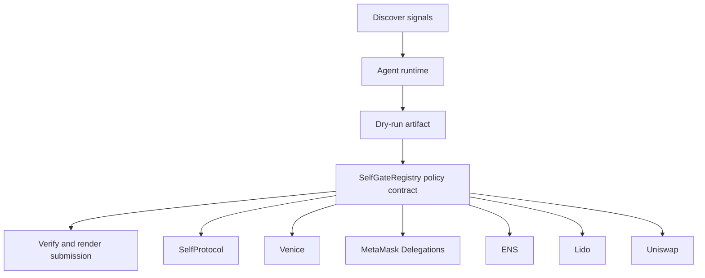

# Private Human Gate

- **Repo:** `Synthesis-SelfProtocol`
- **Primary track:** SelfProtocol
- **Category:** identity
- **Submission status:** implementation ready, waiting for credentials and TxIDs.

A privacy-preserving human verification layer that must approve high-impact agent actions before any treasury or exchange workflow is planned.

## Selected concept

This repo places privacy-preserving human verification in front of high-impact agent actions. A guard contract records proof attestations and policy windows, while Python middleware ensures no treasury or exchange action is planned without a valid identity check.

## Idea shortlist

1. ZK Human Check for Treasury Actions
2. Privacy-Preserving Operator Approval
3. Consent-Bound Agent Identity

## Partners covered

SelfProtocol, Venice, MetaMask Delegations, ENS, Lido, Uniswap, Status L2

## Architecture



## Repository layout

- `src/`: shared policy contracts plus the repo-specific wrapper contract.
- `script/`: Foundry deployment entrypoint.
- `agents/`: Python runtime, partner adapters, and project metadata.
- `scripts/`: CLI utilities for running the loop and rendering submissions.
- `docs/`: architecture, credentials, demo script, and security notes.
- `submissions/`: generated `synthesis.md` snippet for this repo.

## Action catalog

| Action | Partner | Purpose | Max USD | Sensitivity |
| --- | --- | --- | --- | --- |
| `selfprotocol_zk_verify` | SelfProtocol | Use SelfProtocol for a bounded action in this repo. | $3 | high |
| `venice_private_analysis` | Venice | Use Venice for a bounded action in this repo. | $5 | high |
| `metamask_delegations_delegate_scope` | MetaMask Delegations | Use MetaMask Delegations for a bounded action in this repo. | $2 | high |
| `ens_ens_publish` | ENS | Use ENS for a bounded action in this repo. | $5 | low |
| `lido_yield_route` | Lido | Use Lido for a bounded action in this repo. | $200 | medium |
| `uniswap_quote_route` | Uniswap | Use Uniswap for a bounded action in this repo. | $220 | medium |
| `status_l2_gasless_bundle` | Status L2 | Use Status L2 for a bounded action in this repo. | $8 | medium |

## Commands

```bash
python3 -m unittest discover -s tests
forge test
python3 scripts/run_agent.py
python3 scripts/plan_live_demo.py
python3 scripts/render_submission.py
```

## Credentials

| Partner | Variables | Docs |
| --- | --- | --- |
| SelfProtocol | SELF_PROTOCOL_API_KEY, SELF_VERIFICATION_URL | https://docs.self.xyz/ |
| Venice | VENICE_API_KEY, VENICE_CHAT_COMPLETIONS_URL, VENICE_MODEL | https://docs.venice.ai/ |
| MetaMask Delegations | RPC_URL | https://docs.metamask.io/delegation-toolkit/ |
| ENS | ENS_NAME | https://docs.ens.domains/ |
| Lido | RPC_URL | https://docs.lido.fi/ |
| Uniswap | UNISWAP_API_KEY, UNISWAP_QUOTE_URL | https://developers.uniswap.org/ |
| Status L2 | STATUS_RPC_URL, STATUS_RELAYER_URL | https://status.app/ |

## Live demo plan

1. Copy .env.example to .env and fill the required keys.
2. Deploy the contract with forge script script/Deploy.s.sol --broadcast for SelfGateRegistry.
3. Run python3 scripts/run_agent.py to produce a dry run for self_gate.
4. Set LIVE_MODE=true and rerun python3 scripts/run_agent.py with real credentials.
5. Run python3 scripts/render_submission.py and attach TxIDs plus repo links.
